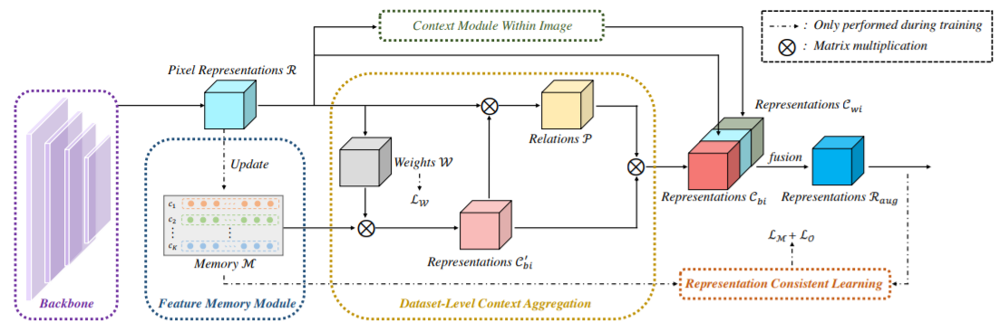

## Introduction

The official repository for "[Mining Contextual Information Beyond Image for Semantic Segmentation](https://arxiv.org/abs/2108.11819)".
Our full code has been merged into [sssegmentation](https://github.com/SegmentationBLWX/sssegmentation).


## Abstract

This paper studies the context aggregation problem in semantic image segmentation. 
The existing researches focus on improving the pixel representations by aggregating the contextual information within individual images. 
Though impressive, these methods neglect the significance of the representations of the pixels of the corresponding class beyond the input image. 
To address this, this paper proposes to mine the contextual information beyond individual images to further augment the pixel representations. 
We first set up a feature memory module, which is updated dynamically during training, to store the dataset-level representations of various categories. 
Then, we learn class probability distribution of each pixel representation under the supervision of the ground-truth segmentation. 
At last, the representation of each pixel is augmented by aggregating the dataset-level representations based on the corresponding class probability distribution. 
Furthermore, by utilizing the stored dataset-level representations, we also propose a representation consistent learning strategy to make the classification head better address intra-class compactness and inter-class dispersion. 
The proposed method could be effortlessly incorporated into existing segmentation frameworks (e.g., FCN, PSPNet, OCRNet and DeepLabV3) and brings consistent performance improvements. 
Mining contextual information beyond image allows us to report state-of-the-art performance on various benchmarks: ADE20K, LIP, Cityscapes and COCO-Stuff.


## Framework




## Performance

#### COCOStuff-10k
| Model         | Backbone     | Crop Size  | Schedule                              | Train/Eval Set  | mIoU/mIoU (ms+flip)  | Download                                                                                                                                                                                                                                                                                                                                                                                                                         |
| :-:           | :-:          | :-:        | :-:                                   | :-:             | :-:                  | :-:                                                                                                                                                                                                                                                                                                                                                                                                                              |
| DeepLabV3     | R-50-D8      | 512x512    | LR/POLICY/BS/EPOCH: 0.001/poly/16/110 | train/test      | 38.84%/39.68%        | [cfg](https://raw.githubusercontent.com/SegmentationBLWX/sssegmentation/main/ssseg/configs/memorynet/memorynet_deeplabv3_resnet50os8_cocostuff10k.py) &#124; [model](https://github.com/SegmentationBLWX/modelstore/releases/download/ssseg_memorynet/deeplabv3_r50_cocostuff10k.pth) &#124; [log](https://github.com/SegmentationBLWX/modelstore/releases/download/ssseg_memorynet/deeplabv3_r50_cocostuff10k.log)              |
| DeepLabV3     | R-101-D8     | 512x512    | LR/POLICY/BS/EPOCH: 0.001/poly/16/110 | train/test      | 39.84%/41.49%        | [cfg](https://raw.githubusercontent.com/SegmentationBLWX/sssegmentation/main/ssseg/configs/memorynet/memorynet_deeplabv3_resnet101os8_cocostuff10k.py) &#124; [model](https://github.com/SegmentationBLWX/modelstore/releases/download/ssseg_memorynet/deeplabv3_r101_cocostuff10k.pth) &#124; [log](https://github.com/SegmentationBLWX/modelstore/releases/download/ssseg_memorynet/deeplabv3_r101_cocostuff10k.log)           |
| DeepLabV3     | S-101-D8     | 512x512    | LR/POLICY/BS/EPOCH: 0.001/poly/32/150 | train/test      | 41.18%/42.15%        | [cfg](https://raw.githubusercontent.com/SegmentationBLWX/sssegmentation/main/ssseg/configs/memorynet/memorynet_deeplabv3_resnest101os8_cocostuff10k.py) &#124; [model](https://github.com/SegmentationBLWX/modelstore/releases/download/ssseg_memorynet/deeplabv3_s101_cocostuff10k.pth) &#124; [log](https://github.com/SegmentationBLWX/modelstore/releases/download/ssseg_memorynet/deeplabv3_s101_cocostuff10k.log)          |
| DeepLabV3     | HRNetV2p-W48 | 512x512    | LR/POLICY/BS/EPOCH: 0.001/poly/16/110 | train/test      | 39.77%/41.35%        | [cfg](https://raw.githubusercontent.com/SegmentationBLWX/sssegmentation/main/ssseg/configs/memorynet/memorynet_deeplabv3_hrnetv2w48_cocostuff10k.py) &#124; [model](https://github.com/SegmentationBLWX/modelstore/releases/download/ssseg_memorynet/deeplabv3_hrnetv2w48_cocostuff10k.pth) &#124; [log](https://github.com/SegmentationBLWX/modelstore/releases/download/ssseg_memorynet/deeplabv3_hrnetv2w48_cocostuff10k.log) |
| DeepLabV3     | ViT-Large    | 512x512    | LR/POLICY/BS/EPOCH: 0.001/poly/16/110 | train/test      | 44.01%/45.23%        | [cfg](https://raw.githubusercontent.com/SegmentationBLWX/sssegmentation/main/ssseg/configs/memorynet/memorynet_deeplabv3_vitlarge_cocostuff10k.py) &#124; [model](https://github.com/SegmentationBLWX/modelstore/releases/download/ssseg_memorynet/deeplabv3_vitlarge_cocostuff10k.pth) &#124; [log](https://github.com/SegmentationBLWX/modelstore/releases/download/ssseg_memorynet/deeplabv3_vitlarge_cocostuff10k.log)       |

#### ADE20k
| Model         | Backbone     | Crop Size  | Schedule                              | Train/Eval Set  | mIoU/mIoU (ms+flip)  | Download                                                                                                                                                                                                                                                                                                                                                                                                       |
| :-:           | :-:          | :-:        | :-:                                   | :-:             | :-:                  | :-:                                                                                                                                                                                                                                                                                                                                                                                                            |
| DeepLabV3     | R-50-D8      | 512x512    | LR/POLICY/BS/EPOCH: 0.01/poly/16/130  | train/val       | 44.39%/45.95%        | [cfg](https://raw.githubusercontent.com/SegmentationBLWX/sssegmentation/main/ssseg/configs/memorynet/memorynet_deeplabv3_resnet50os8_ade20k.py) &#124; [model](https://github.com/SegmentationBLWX/modelstore/releases/download/ssseg_memorynet/deeplabv3_r50_ade20k.pth) &#124; [log](https://github.com/SegmentationBLWX/modelstore/releases/download/ssseg_memorynet/deeplabv3_r50_ade20k.log)              |
| DeepLabV3     | R-101-D8     | 512x512    | LR/POLICY/BS/EPOCH: 0.01/poly/16/130  | train/val       | 45.66%/47.22%        | [cfg](https://raw.githubusercontent.com/SegmentationBLWX/sssegmentation/main/ssseg/configs/memorynet/memorynet_deeplabv3_resnet101os8_ade20k.py) &#124; [model](https://github.com/SegmentationBLWX/modelstore/releases/download/ssseg_memorynet/deeplabv3_r101_ade20k.pth) &#124; [log](https://github.com/SegmentationBLWX/modelstore/releases/download/ssseg_memorynet/deeplabv3_r101_ade20k.log)           |
| DeepLabV3     | S-101-D8     | 512x512    | LR/POLICY/BS/EPOCH: 0.004/poly/16/180 | train/val       | 46.63%/47.36%        | [cfg](https://raw.githubusercontent.com/SegmentationBLWX/sssegmentation/main/ssseg/configs/memorynet/memorynet_deeplabv3_resnest101os8_ade20k.py) &#124; [model](https://github.com/SegmentationBLWX/modelstore/releases/download/ssseg_memorynet/deeplabv3_s101_ade20k.pth) &#124; [log](https://github.com/SegmentationBLWX/modelstore/releases/download/ssseg_memorynet/deeplabv3_s101_ade20k.log)          |
| DeepLabV3     | HRNetV2p-W48 | 512x512    | LR/POLICY/BS/EPOCH: 0.004/poly/16/180 | train/val       | 45.79%/47.34%        | [cfg](https://raw.githubusercontent.com/SegmentationBLWX/sssegmentation/main/ssseg/configs/memorynet/memorynet_deeplabv3_hrnetv2w48_ade20k.py) &#124; [model](https://github.com/SegmentationBLWX/modelstore/releases/download/ssseg_memorynet/deeplabv3_hrnetv2w48_ade20k.pth) &#124; [log](https://github.com/SegmentationBLWX/modelstore/releases/download/ssseg_memorynet/deeplabv3_hrnetv2w48_ade20k.log) |
| DeepLabV3     | ViT-Large    | 512x512    | LR/POLICY/BS/EPOCH: 0.01/poly/16/130  | train/val       | 49.73%/50.99%        | [cfg](https://raw.githubusercontent.com/SegmentationBLWX/sssegmentation/main/ssseg/configs/memorynet/memorynet_deeplabv3_vitlarge_ade20k.py) &#124; [model](https://github.com/SegmentationBLWX/modelstore/releases/download/ssseg_memorynet/deeplabv3_vitlarge_ade20k.pth) &#124; [log](https://github.com/SegmentationBLWX/modelstore/releases/download/ssseg_memorynet/deeplabv3_vitlarge_ade20k.log)       |

#### CityScapes
| Model         | Backbone     | Crop Size  | Schedule                              | Train/Eval Set  | mIoU (ms+flip)       | Download                                                                                                                                                                                                                                                                                                                                                                                                                   |
| :-:           | :-:          | :-:        | :-:                                   | :-:             | :-:                  | :-:                                                                                                                                                                                                                                                                                                                                                                                                                        |
| DeepLabV3     | R-50-D8      | 512x1024   | LR/POLICY/BS/EPOCH: 0.01/poly/16/440  | trainval/test   | 79.90%               | [cfg](https://raw.githubusercontent.com/SegmentationBLWX/sssegmentation/main/ssseg/configs/memorynet/memorynet_deeplabv3_resnet50os8_cityscapes.py) &#124; [model](https://github.com/SegmentationBLWX/modelstore/releases/download/ssseg_memorynet/deeplabv3_r50_cityscapes.pth) &#124; [log](https://github.com/SegmentationBLWX/modelstore/releases/download/ssseg_memorynet/deeplabv3_r50_cityscapes.log)              |
| DeepLabV3     | R-101-D8     | 512x1024   | LR/POLICY/BS/EPOCH: 0.01/poly/16/440  | trainval/test   | 82.03%               | [cfg](https://raw.githubusercontent.com/SegmentationBLWX/sssegmentation/main/ssseg/configs/memorynet/memorynet_deeplabv3_resnet101os8_cityscapes.py) &#124; [model](https://github.com/SegmentationBLWX/modelstore/releases/download/ssseg_memorynet/deeplabv3_r101_cityscapes.pth) &#124; [log](https://github.com/SegmentationBLWX/modelstore/releases/download/ssseg_memorynet/deeplabv3_r101_cityscapes.log)           |
| DeepLabV3     | S-101-D8     | 512x1024   | LR/POLICY/BS/EPOCH: 0.01/poly/16/500  | trainval/test   | 81.59%               | [cfg](https://raw.githubusercontent.com/SegmentationBLWX/sssegmentation/main/ssseg/configs/memorynet/memorynet_deeplabv3_resnest101os8_cityscapes.py) &#124; [model](https://github.com/SegmentationBLWX/modelstore/releases/download/ssseg_memorynet/deeplabv3_s101_cityscapes.pth) &#124; [log](https://github.com/SegmentationBLWX/modelstore/releases/download/ssseg_memorynet/deeplabv3_s101_cityscapes.log)          |
| DeepLabV3     | HRNetV2p-W48 | 512x1024   | LR/POLICY/BS/EPOCH: 0.01/poly/16/500  | trainval/test   | 82.55%               | [cfg](https://raw.githubusercontent.com/SegmentationBLWX/sssegmentation/main/ssseg/configs/memorynet/memorynet_deeplabv3_hrnetv2w48_cityscapes.py) &#124; [model](https://github.com/SegmentationBLWX/modelstore/releases/download/ssseg_memorynet/deeplabv3_hrnetv2w48_cityscapes.pth) &#124; [log](https://github.com/SegmentationBLWX/modelstore/releases/download/ssseg_memorynet/deeplabv3_hrnetv2w48_cityscapes.log) |

#### LIP
| Model         | Backbone     | Crop Size  | Schedule                              | Train/Eval Set  | mIoU/mIoU (flip)     | Download                                                                                                                                                                                                                                                                                                                                                                                              |
| :-:           | :-:          | :-:        | :-:                                   | :-:             | :-:                  | :-:                                                                                                                                                                                                                                                                                                                                                                                                   |
| DeepLabV3     | R-50-D8      | 473x473    | LR/POLICY/BS/EPOCH: 0.01/poly/32/150  | train/val       | 53.73%/54.08%        | [cfg](https://raw.githubusercontent.com/SegmentationBLWX/sssegmentation/main/ssseg/configs/memorynet/memorynet_deeplabv3_resnet50os8_lip.py) &#124; [model](https://github.com/SegmentationBLWX/modelstore/releases/download/ssseg_memorynet/deeplabv3_r50_lip.pth) &#124; [log](https://github.com/SegmentationBLWX/modelstore/releases/download/ssseg_memorynet/deeplabv3_r50_lip.log)              |
| DeepLabV3     | R-101-D8     | 473x473    | LR/POLICY/BS/EPOCH: 0.01/poly/32/150  | train/val       | 55.02%/55.42%        | [cfg](https://raw.githubusercontent.com/SegmentationBLWX/sssegmentation/main/ssseg/configs/memorynet/memorynet_deeplabv3_resnet101os8_lip.py) &#124; [model](https://github.com/SegmentationBLWX/modelstore/releases/download/ssseg_memorynet/deeplabv3_r101_lip.pth) &#124; [log](https://github.com/SegmentationBLWX/modelstore/releases/download/ssseg_memorynet/deeplabv3_r101_lip.log)           |
| DeepLabV3     | S-101-D8     | 473x473    | LR/POLICY/BS/EPOCH: 0.007/poly/40/150 | train/val       | 56.21%/56.34%        | [cfg](https://raw.githubusercontent.com/SegmentationBLWX/sssegmentation/main/ssseg/configs/memorynet/memorynet_deeplabv3_resnest101os8_lip.py) &#124; [model](https://github.com/SegmentationBLWX/modelstore/releases/download/ssseg_memorynet/deeplabv3_s101_lip.pth) &#124; [log](https://github.com/SegmentationBLWX/modelstore/releases/download/ssseg_memorynet/deeplabv3_s101_lip.log)          |
| DeepLabV3     | HRNetV2p-W48 | 473x473    | LR/POLICY/BS/EPOCH: 0.007/poly/40/150 | train/val       | 56.40%/56.99%        | [cfg](https://raw.githubusercontent.com/SegmentationBLWX/sssegmentation/main/ssseg/configs/memorynet/memorynet_deeplabv3_hrnetv2w48_lip.py) &#124; [model](https://github.com/SegmentationBLWX/modelstore/releases/download/ssseg_memorynet/deeplabv3_hrnetv2w48_lip.pth) &#124; [log](https://github.com/SegmentationBLWX/modelstore/releases/download/ssseg_memorynet/deeplabv3_hrnetv2w48_lip.log) |


## Citation

If this code is useful for your research, please consider citing:

```latex
@inproceedings{jin2021mining,
    title={Mining Contextual Information Beyond Image for Semantic Segmentation},
    author={Jin, Zhenchao and Gong, Tao and Yu, Dongdong and Chu, Qi and Wang, Jian and Wang, Changhu and Shao, Jie},
    booktitle={Proceedings of the IEEE/CVF International Conference on Computer Vision},
    pages={7231--7241},
    year={2021}
}
```